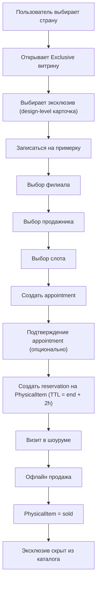

## 1. Обзор продукта
Платформа ювелирного бренда с витриной (готовые украшения, камни, эксклюзивы, конструктор), мульти-регионами/языками и офлайн-конверсией через запись в шоурум с резервированием конкретного экземпляра.
Система включает 4 отдельные консоли: контент-модерация, каталог-админ, шоурум-консоль (продажи/резервы/производство), аналитика.

## 2. Ключевые функции

### 2.1 Роли пользователей
| Роль | Способ доступа | Ключевые права |
|------|----------------|----------------|
| Гость/Клиент | Публичный доступ, опционально регистрация по email/телефону | Просмотр витрины, поиск, избранное, запись в шоурум, консьерж-заявки, просмотр статуса заказа/производства |
| Контент‑модератор | Инвайт в систему (SSO/логин) | Редактирование страниц, коллекций, celebrities, events, медиа, главной (Homepage Builder), отправка на проверку |
| Контент‑лид | Инвайт | Проверка/апрув/публикация контента, rollback версий |
| Каталог‑админ | Инвайт | Управление каталогом украшений, камней (типы/схемы атрибутов), правила видимости, эксклюзив‑курация |
| Продажник шоурума | Инвайт + привязка к филиалу | Календарь, обработка записей, работа с клиентами, фиксация исхода визита, создание сделок |
| Менеджер филиала | Инвайт + привязка к филиалу | Управление резервами (extend/release), подтверждение переноса эксклюзива, управление расписаниями сотрудников филиала |
| Аналитик/Админ сайта | Инвайт | Дашборды, воронки, отчёты, экспорт данных (read‑only) |
| Системный админ | Инвайт | Управление пользователями, ролями, доступами, аудит |

### 2.2 Модули продукта (страницы/разделы)
1. **Витрина**: главная, каталоги (украшения/эксклюзив/камни), карточки, конструктор, шоурумы, запись, консьерж, контентные разделы (collections/celebrities/events), личный кабинет
2. **Контент‑модерация**: управление контентом RU/EN, homepage builder, workflow проверки/публикации, версии/rollback
3. **Каталог‑админ**: PIM украшений, типы камней и конструктор атрибутов, управление видимостью по странам
4. **Showroom Console**: календарь, записи, резервы конкретных экземпляров (TTL до конца записи + 2 часа), переносы эксклюзивов, сделки/заказы, статусы производства, консьерж‑входящие
5. **Аналитика**: воронка online → appointment → visit → deal/order, эффективность филиалов/сотрудников, эксклюзивы

### 2.3 Детализация страниц и функций
| Страница/Экран | Модуль | Описание функции |
|---|---|---|
| Главная | Витрина | Single hero + quick entrances, блок эксклюзивов, подборки, CTA на запись/консьержа; RU/EN; country override |
| Каталог украшений (PLP) | Витрина | Фасетный поиск, сортировка, коллекции/категории, переход в PDP |
| Карточка украшения (PDP) | Витрина | Галерея, варианты (размер/металл), CTA “Записаться на примерку”, доверие (гарантии/уход), контекст филиала |
| Каталог эксклюзива (PLP) | Витрина | Показ только в выбранной стране, карточки design-level с указанием филиала, статусы available/reserved |
| Карточка эксклюзива (PDP) | Витрина | One-of-one, show “в каком филиале”, запись на примерку, при reserved — только консьерж |
| Каталог камней (PLP) | Витрина | Типы камней расширяемы; режим новичок/эксперт; фильтры из схем атрибутов |
| Карточка камня (PDP) | Витрина | Атрибуты, сертификат, медиа; CTA “Записаться на консультацию” (без резерва) |
| Конструктор (wizard) | Витрина | Start with stone / start with setting; совместимость; сохранение сборки; отправка консьержу |
| Запись в шоурум | Витрина | Выбор филиала → продажника → слота; создание резерва на конкретный physical item при примерке изделия |
| Шоурумы | Витрина | Список филиалов по стране, карточка филиала, контакты, кнопка записи |
| Concierge | Витрина | Форма запроса, привязка контекста (design/build/stone), SLA статус |
| Collections / Celebrities / Events | Витрина | Контентные лэндинги, подборки товаров, RU/EN |
| Личный кабинет | Витрина | Мои записи, мои заказы, статусы производства, сохранённые сборки |
| Content Moderator Console | Админка | Контент, homepage builder, медиа, RU/EN, отправка на ревью |
| Catalog Admin | Админка | PIM украшений/камней, схемы атрибутов, эксклюзив‑правила, видимость по странам |
| Showroom Console | Админка | Calendar, reservations (TTL), clients, deals/orders, production, transfer confirmations |
| Admin Analytics | Админка | Funnels и KPI, staff/branch performance, эксклюзивы, экспорт |

## 3. Основные процессы

### 3.1 Ключевые пользовательские сценарии (витрина)
1. Пользователь выбирает страну → видит только доступные эксклюзивы этой страны → видит филиал хранения → записывается на примерку конкретного экземпляра → экземпляр резервируется до конца записи + 2 часа.
2. Пользователь выбирает камень → читает параметры/сертификат → записывается на консультацию → без резерва инвентаря.
3. Пользователь собирает изделие в конструкторе → сохраняет сборку → отправляет консьержу или записывается на консультацию.

### 3.2 Операционные сценарии (шоурум)
1. Подтверждение записи → создание резерва на physical item → визит → продажа в шоуруме (офлайн оплата) → для эксклюзива item становится sold и пропадает из каталога.
2. Перенос эксклюзива между странами: модератор создаёт запрос → шоурум подтверждает получение → только после подтверждения эксклюзив “переезжает” на витрине (режим A).

### 3.3 Диаграмма потоков (Mermaid)

## 4. Дизайн интерфейса

### 4.1 Визуальный стиль (ориентир: премиальный минимализм)
- Палитра: молочно‑белый/графит/мягкие серые, акцент через металл (платина/золото) и фотографию
- Типографика: контрастная “editorial” гарнитура для заголовков + нейтральная читаемая для текста; аккуратные капс‑лейблы
- UI‑паттерны: много воздуха, тонкие разделители, минимальные иконки, аккуратные состояния “reserved/available/sold”
- Микроанимации: деликатные (fade/slide), без навязчивых автослайдеров; hero по умолчанию single
- Доверие: блоки сертификатов/происхождения/гарантий, ясные статусы наличия и филиала

### 4.2 Обзор UI по страницам
| Страница | Модуль | UI‑элементы |
|---|---|---|
| Главная | Hero + Quick entrances | Полноэкранная композиция, 4–6 плиток сценариев, блок эксклюзивов со статусами и филиалом |
| PLP (украшения/камни) | Фильтры | Фасеты, chips выбранных фильтров, сортировка, быстрый переход, “режим новичок/эксперт” для камней |
| PDP эксклюзива | Scarcity + booking | Бейдж “one‑of‑one”, филиал, CTA записи, при reserved — CTA консьержа |
| Запись | Calendar | Выбор филиала/продажника, календарь слотов, подтверждение, описание политики резерва |
| Showroom Console | Таблицы/календарь | Календарь по сотруднику/филиалу, таблица резервов, действия менеджера (extend/release) |

### 4.3 Адаптивность
- Desktop-first, mobile-adaptive
- Мобильные паттерны: bottom sheet для фильтров, sticky CTA на PDP, ускоренный календарь записи
- Производительность: критично для медиа (особенно hero), lazy-loading, оптимизация изображений

