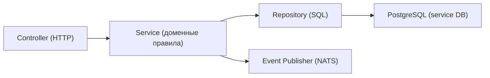
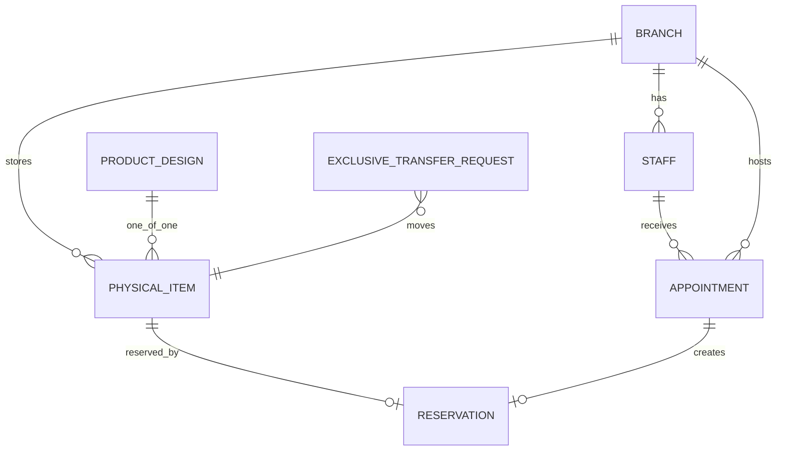

## 1. Проектирование архитектуры

```mermaid
flowchart TB
  subgraph FE["Frontend (витрина и консоли)"]
    SF["Storefront Web (RU/EN, country switch)"]
    AC["Admin Content (модераторы)"]
    AK["Admin Catalog (каталог‑админы)"]
    AA["Admin Analytics (аналитика)"]
    SC["Showroom Console (продажи/резервы)"]
  end

  subgraph BFF["BFF слой (агрегация)"]
    BFFS["BFF Storefront"]
    BFFA["BFF Admin"]
    BFFR["BFF Showroom"]
  end

  subgraph SVC["Backend сервисы (Node.js + TypeScript)"]
    IAM["IAM Service"]
    REG["Regions Service"]
    CMS["CMS Service"]
    JC["Jewelry Catalog Service"]
    STC["Stones Catalog Service"]
    INV["Inventory Service"]
    APP["Appointments Service"]
    CON["Concierge Service"]
    ORD["Sales/Orders Service"]
    PRD["Production Service"]
  end

  subgraph DATA["Хранилища данных (database per service)"]
    DBIAM["PostgreSQL: iam_db"]
    DBREG["PostgreSQL: regions_db"]
    DBCMS["PostgreSQL: cms_db"]
    DBJC["PostgreSQL: jewelry_db"]
    DBST["PostgreSQL: stones_db"]
    DBINV["PostgreSQL: inventory_db"]
    DBAPP["PostgreSQL: appointments_db"]
    DBCON["PostgreSQL: concierge_db"]
    DBORD["PostgreSQL: orders_db"]
    DBPRD["PostgreSQL: production_db"]
    REDIS["Redis (очереди/TTL)"]
  end

  subgraph BUS["События и интеграции"]
    NATS["Event Bus (NATS)"]
    SEARCH["Search (позже)"]
    ANALYT["Analytics (позже)"]
    MEDIA["Object Storage + CDN (медиа)"]
  end

  SF --> BFFS
  AC --> BFFA
  AK --> BFFA
  AA --> BFFA
  SC --> BFFR

  BFFS --> IAM
  BFFS --> REG
  BFFS --> CMS
  BFFS --> JC
  BFFS --> STC
  BFFS --> INV
  BFFS --> APP
  BFFS --> CON

  BFFA --> IAM
  BFFA --> CMS
  BFFA --> JC
  BFFA --> STC
  BFFA --> REG

  BFFR --> IAM
  BFFR --> REG
  BFFR --> INV
  BFFR --> APP
  BFFR --> CON
  BFFR --> ORD
  BFFR --> PRD

  IAM --> DBIAM
  REG --> DBREG
  CMS --> DBCMS
  JC --> DBJC
  STC --> DBST
  INV --> DBINV
  APP --> DBAPP
  CON --> DBCON
  ORD --> DBORD
  PRD --> DBPRD

  APP --> REDIS
  PRD --> REDIS

  INV --> NATS
  APP --> NATS
  CMS --> NATS
  JC --> NATS
  STC --> NATS
  ORD --> NATS
  PRD --> NATS
  CON --> NATS

  NATS --> SEARCH
  NATS --> ANALYT
  CMS --> MEDIA
  JC --> MEDIA
  STC --> MEDIA
```



## 2. Описание технологий
- Frontend (витрина): React + SSR/SEO‑готовый рендер (на практике удобно использовать Next.js).  
- Frontend (консоли): React SPA (Vite) + общий UI‑Kit в monorepo.
- BFF: Fastify + TypeScript (агрегация данных сервисов, батч‑резолв карточек).
- Backend сервисы: Node.js + TypeScript (NestJS с Fastify адаптером).
- Базы данных: PostgreSQL, отдельная база на сервис.
- Очереди/TTL/фоновая обработка: Redis + BullMQ (или аналог).
- Event bus: NATS (схемы событий в packages/event-bus).
- Контракты API: OpenAPI 3.1 (генерация типов клиента/серверных DTO).
- Медиа: S3‑совместимое хранилище + CDN; в БД храним только asset_id и метаданные.
- Observability: OpenTelemetry (traces), метрики Prometheus/Grafana, структурные логи.

## 3. Определение маршрутов

### 3.1 Маршруты витрины (Storefront)
| Route | Назначение |
|---|---|
| / | Главная (single hero + quick entrances, подборки, CTA) |
| /jewelry | Каталог украшений |
| /jewelry/[slug] | Карточка украшения |
| /exclusive | Эксклюзив (только для выбранной страны) |
| /exclusive/[slug] | Карточка эксклюзива (филиал, статус, запись) |
| /stones | Каталог камней |
| /stones/[id] | Карточка камня |
| /create | Конструктор (wizard) |
| /showrooms | Список филиалов (по стране) |
| /showrooms/[id] | Карточка филиала |
| /appointments | Запись в шоурум |
| /concierge | Консьерж‑заявка |
| /collections /celebrities /events | Контентные разделы |
| /account | Личный кабинет (записи, заказы, статусы производства) |

### 3.2 Маршруты админок (4 консоли)
| Приложение | Route base | Назначение |
|---|---|---|
| Admin Content | /admin/content | Контент, homepage builder, RU/EN, ревью |
| Admin Catalog | /admin/catalog | PIM украшений, камни (types/schema), видимость |
| Showroom Console | /showroom | Записи/календарь/резервы/сделки/производство |
| Admin Analytics | /admin/analytics | Funnels, staff/branch performance, экспорт |

## 4. Определение API (высокоуровнево)

### 4.1 Принципы API
- Сервисы предоставляют REST API по OpenAPI контрактам.
- BFF агрегирует и резолвит карточки (особенно для home/exclusive), чтобы избежать множества запросов.
- Межсервисные связи: только через стабильные идентификаторы (UUID/ULID), без cross‑DB FK.

### 4.2 Ключевые API контуры (MVP)
- IAM: login/refresh/me + роли/скоупы (branch/country).
- Regions: countries/branches/staff/schedules.
- CMS: public homepage/pages/collections/celebrities/events + admin workflow (draft/review/publish/versions).
- Jewelry: public search + PDP + admin CRUD (designs/variants/options/media).
- Stones: public search + PDP + admin CRUD (types/schema/stones/certificates).
- Inventory: physical items + transfer workflow (request by moderator → complete by showroom).
- Appointments: availability + appointment create/confirm/cancel + reservations (TTL = end + 2h, extend manager only).

## 5. Диаграмма архитектуры сервера (на примере сервиса)



## 6. Модель данных

### 6.1 ER-диаграмма (ядро: showrooms/reservations/exclusive)


### 6.2 DDL (минимум для appointments_db)
```sql
CREATE TABLE appointments (
  id uuid PRIMARY KEY,
  country_code text NOT NULL,
  branch_id uuid NOT NULL,
  staff_id uuid NOT NULL,
  type_id uuid NOT NULL,
  status text NOT NULL,
  starts_at timestamptz NOT NULL,
  ends_at timestamptz NOT NULL,
  customer_name text NOT NULL,
  customer_phone text,
  customer_email text,
  context_json jsonb NOT NULL DEFAULT '{}'::jsonb,
  created_at timestamptz NOT NULL DEFAULT now(),
  updated_at timestamptz NOT NULL DEFAULT now()
);

CREATE INDEX idx_appointments_branch_time ON appointments(branch_id, starts_at);
CREATE INDEX idx_appointments_staff_time ON appointments(staff_id, starts_at);

CREATE TABLE reservations (
  id uuid PRIMARY KEY,
  physical_item_id uuid NOT NULL,
  appointment_id uuid NOT NULL,
  status text NOT NULL,
  reserved_from timestamptz NOT NULL,
  reserved_until timestamptz NOT NULL,
  created_at timestamptz NOT NULL DEFAULT now()
);

CREATE UNIQUE INDEX uniq_active_reservation_per_item
  ON reservations(physical_item_id)
  WHERE status = 'active';
```

